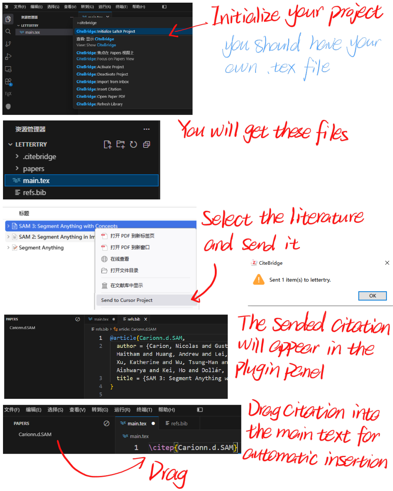



# CiteBridge 安装与使用

CiteBridge 用来连接 Zotero 和 Cursor / VS Code 中的 LaTeX 项目。它由两个插件组成：

- `citebridge-cursor-0.1.4.vsix`：安装到 Cursor 或 VS Code，用于初始化 LaTeX 项目、接收 Zotero 文献、维护 `refs.bib`、显示 CiteBridge 文献面板，并支持拖拽插入引用。
- `citebridge-zotero-0.1.5.xpi`：安装到 Zotero，用于在文献右键菜单中添加 `Send to Cursor Project`，把选中文献发送给当前激活的 LaTeX 项目。

## 文件

```text
citebridge-cursor-0.1.4.vsix
citebridge-zotero-0.1.5.xpi
README.zh-CN.md
README.en-US.md
```

## 安装 Cursor / VS Code 插件

1. 打开 Cursor 或 VS Code。
2. 打开 Extensions 面板。
3. 选择 `Install from VSIX...`。
4. 选择 `citebridge-cursor-0.1.4.vsix`。
5. 安装完成后重启编辑器。

## 安装 Zotero 插件

1. 打开 Zotero。
2. 点击 `工具 -> 插件`。
3. 点击插件管理器右上角齿轮按钮。
4. 选择 `Install Add-on From File...`，中文界面可能显示为 `从文件安装附加组件...`。
5. 选择 `citebridge-zotero-0.1.5.xpi`。
6. 安装完成后重启 Zotero。

## 初始化 LaTeX 项目

1. 在 Cursor 或 VS Code 中打开你的 LaTeX 项目文件夹。
2. 按 `Ctrl + Shift + P` 打开命令面板。
3. 运行：

```text
CiteBridge: Initialize LaTeX Project
```

初始化后，项目中会生成：

```text
refs.bib
papers/
.citebridge/
```

如果项目已经初始化过，再次运行该命令只会补齐缺失文件并刷新项目注册，不会清空已经导入的文献索引。

## 激活目标项目

如果你有多个 LaTeX 项目，需要指定 Zotero 发送到哪个项目。

1. 在 Cursor 或 VS Code 打开目标 LaTeX 项目。
2. 打开左侧 CiteBridge 面板。
3. 点击面板右上角的 `Activate Project` 按钮。
4. 激活后按钮会变成 `Deactivate Project`。

Zotero 发送文献时会优先发送到当前激活的项目。如果没有任何项目激活，则发送到最近一次激活或使用过的项目。

## 从 Zotero 发送文献

1. 在 Zotero 中选中一篇或多篇普通文献条目。
2. 右键点击文献。
3. 选择：

```text
Send to Cursor Project
```

发送成功后，Zotero 会提示：

```text
Sent 1 item(s) to ...
```

文献会被写入目标 LaTeX 项目的 `.citebridge/inbox/`，Cursor / VS Code 通常会自动导入。若没有自动出现，可在命令面板运行：

```text
CiteBridge: Import from Inbox
```

## 在 LaTeX 中插入引用

1. 在 Cursor 或 VS Code 打开 `.tex` 文件。
2. 在左侧 CiteBridge 面板中找到文献。
3. 将文献拖入正文位置。

默认会插入：

```latex
\citep{Author2025Title}
```

同时 CiteBridge 会维护 `refs.bib`，避免重复写入相同 DOI 或 citekey 的 BibTeX 条目。

## LaTeX 文件建议

如果使用默认的 `\citep{...}`，建议在 `.tex` 文件中使用 `natbib`：

```latex
\usepackage{natbib}
```

文末加入：

```latex
\bibliographystyle{plainnat}
\bibliography{refs}
```

## 常见问题

如果 Zotero 中看不到 `Send to Cursor Project`：

- 确认已安装 `citebridge-zotero-0.1.5.xpi`
- 重启 Zotero
- 确认右键的是普通文献条目，而不是分类、附件或笔记

如果 CiteBridge 面板没有新文献：

- 确认目标项目已经初始化
- 确认目标项目已点击 `Activate Project`
- 在命令面板中运行 `CiteBridge: Import from Inbox`

如果拖拽后没有插入引用：

- 确认已安装 `citebridge-cursor-0.1.4.vsix`
- 重启 Cursor 或 VS Code
- 确认拖入的是 `.tex` 文件正文区域

如果 Zotero 发送到错误项目：

- 在 Cursor 或 VS Code 打开正确项目
- 在 CiteBridge 面板点击 `Activate Project`
- 不使用该项目时点击 `Deactivate Project`

## 生成文件及位置

CiteBridge 主要会在两个位置生成或更新文件。

### LaTeX 项目目录

假设你的 LaTeX 项目目录是 `MyPaper/`，初始化和导入文献后，项目中可能出现：

```text
MyPaper/
  refs.bib
  papers/
    Author2025Title.pdf
  .citebridge/
    config.json
    index.json
    inbox/
      import-20250628-120000.json
    items/
      Author2025Title.json
```

这些文件的作用是：

- `refs.bib`：项目的 BibTeX 数据库。CiteBridge 会向其中写入或更新文献条目。
- `papers/*.pdf`：从 Zotero 附件复制到当前 LaTeX 项目中的 PDF 副本。如果文献没有本地 PDF，或复制失败，则不会生成该 PDF。
- `.citebridge/config.json`：当前 LaTeX 项目的 CiteBridge 配置，包括项目 ID、BibTeX 文件名、PDF 保存目录等。
- `.citebridge/index.json`：当前项目已经导入的文献索引，用于在 CiteBridge 面板中显示文献并避免重复导入。
- `.citebridge/inbox/*.json`：Zotero 发送过来的导入请求。Cursor / VS Code 会从这里读取并导入文献。
- `.citebridge/items/*.json`：每篇已导入文献的元数据缓存。该文件不会长期保存 Zotero 附件的本机绝对路径。

### 用户目录

CiteBridge 还会在用户目录下维护一个全局项目注册文件：

```text
C:\Users\你的用户名\.citebridge\projects.json
```

在 macOS 或 Linux 上通常是：

```text
~/.citebridge/projects.json
```

这个文件记录已经初始化过的 LaTeX 项目、当前激活项目、最近一次使用的项目以及发送所需的项目 token。Zotero 插件通过它判断文献应该发送到哪个 LaTeX 项目。

除此之外，CiteBridge 通常不会主动在其他位置生成项目数据文件。Zotero 或编辑器自己的日志、缓存和插件安装目录属于各自软件的正常运行数据。
